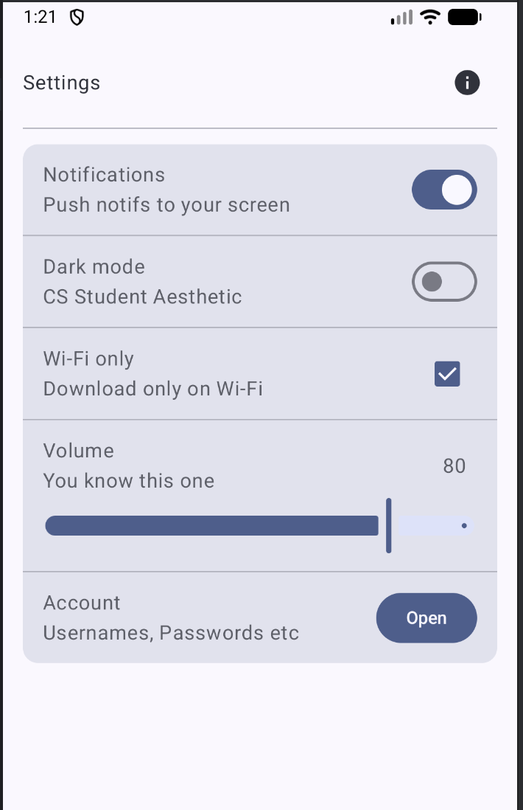

# CS501 HW3 - Settings Screen

This app shows a single polished Settings screen built with Jetpack Compose.

## How to run
- Open in Android Studio
- Run the app on an emulator or device

## Requirements met
- Layout uses a top-level Column.
- Each setting row is a Row with a left Column (label + supporting text) and a right-side control.
- Modifier.weight() keeps text from truncating and aligns controls.
- Material 3 components used (at least 6): Card, Switch, Checkbox, Slider, Button, HorizontalDivider, IconButton, Icon.
- Modifiers demonstrated: padding, fillMaxWidth, weight, heightIn, align, background, clickable.

## Screenshot
- Settings screen: \

## AI disclosure
- AI was used to help write this README, to better understand assignment instructions, to make sure all requirements were met, and for some debugging.
